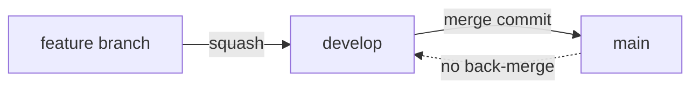
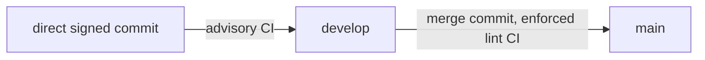
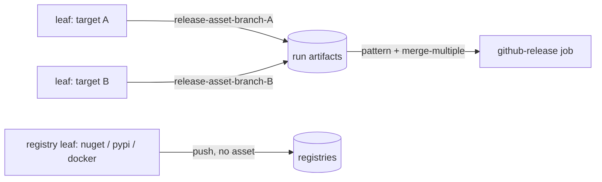
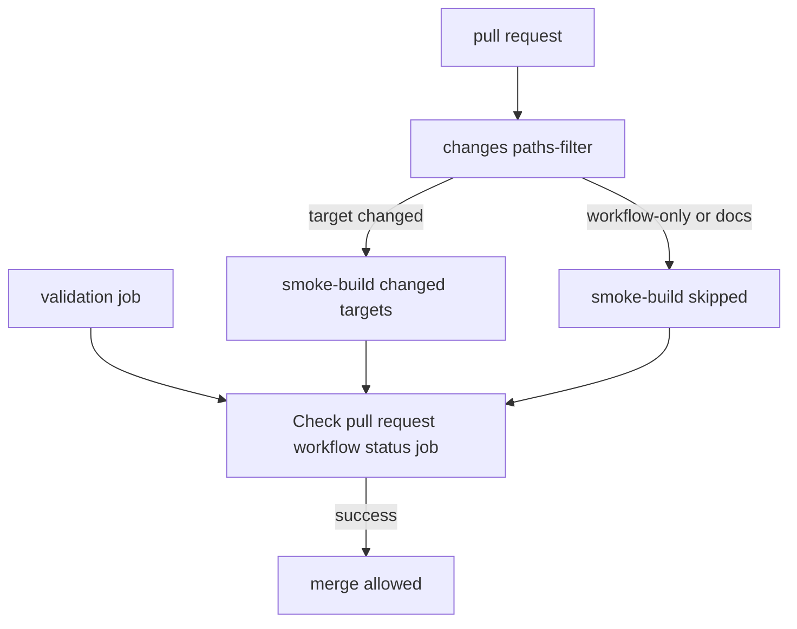
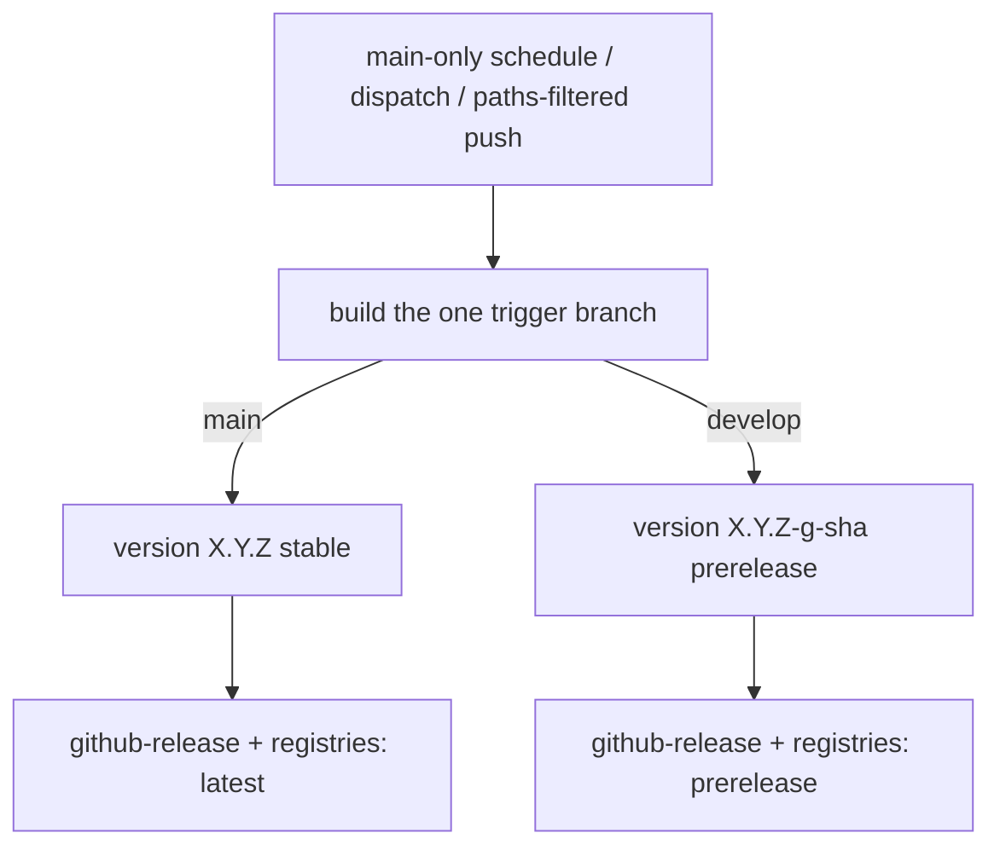

# WORKFLOW.md

The guide for CI/CD **workflows** (GitHub Actions): a deliberate mixture of code style, architecture, a **behavioral contract** (expected inputs and outputs), and a **test methodology**. Code style lives in [`CODESTYLE.md`][codestyle]; this file is its sibling for everything under [`.github/workflows/`][workflows].

Its defining principle: **it describes required outcomes, not a required implementation.** Two repos may implement the same guarantee with different YAML. A workflow is correct when it **satisfies the contract** in section 4 and is **defect-free against the expected inputs and outputs** - not when it matches the template byte for byte. The conventions in section 2 keep workflows legible; the contract in section 4 is what they must *do*.

Given this document, an agent must be able to do three things to any project:

1. **Audit** - statically check the workflows against the conventions (section 2) and the structural facts each guarantee implies (section 5A).
2. **Test** - trace the expected inputs/outputs (section 5B) and, where warranted, drive a live probe (section 5C).
3. **Assess** - render a verdict: **operational** (every *applicable* guarantee holds and every *applicable* scenario's observed output equals the expected) or **not operational** (any mismatch - which is a *defect*, not a style nit).

> **Canonical scope.** This document is authoritative for the workflow contract and test methodology (sections 3 to 6). The conventions in section 2 and the release policy also live in `AGENTS.md` ("Workflow YAML Conventions" and "Release Model"), which is authoritative where the two overlap; section 2 restates them so this file reads on its own. On any conflict in that overlap, `AGENTS.md` wins.

The guarantees are distilled from failures observed in practice and stated as the **failure-mode each prevents**, so the document stays portable to any project.

## 1. Purpose and How to Use This Document

- **Contract, not implementation.** Conform to the *outcomes* in section 4. Shape, job names, and file layout may differ between repos; the input/output behavior may not.
- **Applicability.** A guarantee (or a 5A check, or a 5B scenario) is **applicable** only if the repo contains the construct it governs - a given target, a transfer artifact, a registry push, a wrapper-version source. An item that governs an absent construct is **N/A**: record it as N/A and **exclude it from the verdict**. N/A is never a defect. Section 6 names which items go N/A per project type; a near-empty pipeline (source-only) is mostly N/A and that is fine.
- **Operational is binary.** A workflow is operational only if every *applicable* guarantee holds. A single applicable input/output mismatch is a defect and makes the workflow non-operational, regardless of how clean the YAML looks.
- **Default branch.** Guarantees say "default branch" portably; the template implements it as the literal `main` in several places (the validate gate, the `prerelease` expression, and `version.json`'s `publicReleaseRefSpec`). These MUST all reference the repo's *actual* default branch; a divergence is a defect (section 5A).
- **Two layers when auditing.** The pipeline splits into an **orchestrator** layer (the PR entry workflow, the publisher, and the version/release/badge jobs) and a **build-leaf** layer (`build-<target>-task.yml`). Inputs like `github`/`nuget`/`dockerhub`/`expect_release_assets` live on the orchestrator; a leaf only ever receives `ref`/`branch`/`smoke` (and a derived `push`). When a check names an input, assert it in the layer that declares it.
- **The three verbs.** Audit (static), Test (trace + probe), Assess (verdict). Section 5 gives the exact procedure.

## 2. Workflow Style Conventions

Prescriptive style/legibility rules. Cheap to check, necessary but not sufficient (a perfectly styled workflow can still violate section 4).

- **Action pinning.** Pin **every** action to a commit SHA with a trailing `# vX.Y.Z` comment. Use `# vX` only when the upstream floating major tag has no specific patch SHA. The single documented no-pin exception is a tool whose tag stream lags `master` such that tag-tracking would downgrade (here, `dotnet/nbgv@master`); invent no others.
- **Filename.** Reusable workflows (`on: workflow_call`) end in `-task.yml`; entry-point workflows do not (`-pull-request.yml`, `-release.yml`). Lowercase, hyphen-separated.
- **Workflow `name:`.** Reusable names end in **"task"**; entry-point names end in **"action"**.
- **Job and step `name:`.** Every job ends in **"job"**, every step in **"step"** - including a ruleset-bound required-check job, whose `name:` and the ruleset `context:` are one string renamed together (never independently).
- **Concurrency.** Top-level workflows declare `concurrency: { group: '${{ github.workflow }}-${{ github.ref }}', cancel-in-progress: true }`. Document exceptions inline (D7).
- **Shells.** Every multi-line bash `run:` starts `set -euo pipefail`.
- **Conditionals.** Multi-line `if:` uses the folded scalar `if: >-`.
- **Boolean inputs.** A boolean used by both `workflow_call` and `workflow_dispatch` is declared in **both** trigger blocks; `workflow_dispatch` delivers the **string** `"true"`/`"false"`, so any `if:` compares both forms: `${{ inputs.foo == true || inputs.foo == 'true' }}`.
- **Reusable-workflow permissions.** Job-level `permissions:` are validated **before** `if:`, so even a skipped job needs valid permissions. Grant least privilege; a reusable callee's extra scope (e.g. `actions: write` for cleanup) is granted by the **caller**.
- **Allowlist `success` and `skipped` explicitly** across optional dependencies (`!= 'failure'` lets `cancelled` through).
- **Docker layer cache.** Cache to/from a registry tag (`type=registry`), never `type=gha`.
- **Line endings.** Workflow YAML is LF (Actions and Dependabot rewrite it that way); other files follow `.editorconfig`, and committed JSON state files follow the repo's JSON rule. Preserve endings on every edit.

## 3. Architecture

### Branch Model

Two workflow models, set per repo by the registry `workflowModel` field. `release` (default) is the feature-branch pipeline this document specifies:

`operational` repos (live-service config; `workflowModel: operational`) commit directly to `develop` and promote a known-good snapshot to `main` via an occasional PR:

Their CI is lint/validation only (editorconfig/EOL plus domain linters - Home Assistant or ESPHome config validation, a firmware build - **no unit tests**), so the D-guarantees below that assume a build/test pipeline are **N/A** exactly as for `source-only` (Section 6). What binds: the promotion gate - the `develop -> main` PR must pass the required `Check pull request workflow status job` - and the source-only release on manual dispatch (`releaseTrigger: dispatch-only`; tag + source zip). Branch-model rulesets are specified in [AGENTS.md "Branching Model"][agents-branching-model] and [repo-config/README.md][repo-config-readme], not here.

### Two Layers: Orchestration vs Build

- **Orchestration** is generic and forms the standardization baseline **at the job level**: the single-branch publisher, the `get-version`, `validate-release`, and `github-release` jobs, the date-badge job, and the `changes -> smoke-build -> aggregator` shape of the PR workflow. These job *bodies* should not need per-repo edits.
- **Build** is repo-owned: the `build-<target>-task.yml` leaf tasks.
- **What the repo curates** (by design, not a leak): the *list* of targets. This is **not** a byte-for-byte file carry. Adding or dropping a target edits the orchestrator's surface - the `enable_<target>` inputs and the `build-<target>` job + its `github-release` `needs:` entry in the release task, **and** the `changes` paths-filter entry + output + the `smoke-build` enable-forward in the PR workflow. "Verbatim" applies to the `github-release` job and the version/publish-plan logic, not to the release task's job list or the paths-filter. Subsetting is symmetric: the same surface you trim to drop a target you extend to add a new one (e.g. a `release-asset-<branch>-library` producer needs a new `enable_library` input, a `build-library` job, a `needs:` entry, and a `library` paths-filter).

### The Seam Contract

A target contributes a file to the GitHub release by uploading a workflow artifact named `release-asset-<branch>-<target>`. The release job collects **every** matching artifact by **pattern** (`pattern: release-asset-<branch>-*` + `merge-multiple: true`), never an `artifact-ids:` naming one job's output. Canonical for **every** repo, single-target included; switching to an `artifact-id` handoff forks the release download and breaks the verbatim carry.

### Reusable-Task Parameter Contract

Every leaf and the release task take `ref`, `branch` (the **logical** branch that drives config/tags/prerelease), and where relevant `smoke`. Branch-derived config keys off `inputs.branch` (the logical branch the caller passes); artifact names are branch-suffixed.

### Versioning

NBGV versions the branch being published. Each run builds a single branch (the trigger ref), so `GITHUB_REF` already names it and NBGV classifies it directly - no `IGNORE_GITHUB_REF` override is required. The default branch is the public-release ref, so it builds clean `X.Y.Z`; every other branch builds a prerelease `X.Y.Z-g<sha>`. `version.json`'s `version` is the major.minor floor; NBGV appends the git height as the patch. **NBGV and `version.json` are retained even by a repo with no compiled code** - they are the source of the release tag (`SemVer2`) and `target_commitish` (`GitCommitId`) and the prerelease classification; the .NET SDK is pulled in only as the versioning toolchain. A package build derives its registry version from the same NBGV outputs, but **not always from `SemVer2`**: the PyPI version is built from `AssemblyFileVersion` (four-part `M.N.P.B`) with a PEP 440 `.dev0` appended on the `develop` branch. A wrapper repo may drive its build/image version from an external committed `name -> version` state file while NBGV still tags the release.

### Validate-at-Entry

When a workflow's inputs carry a cross-input or input-versus-derived-state invariant, assert it **once** in a dedicated entry job/step the downstream jobs `needs:`, failing fast with `::error::` before any build or publish.

### Resource Lifecycle

Workflow artifacts are an **intra-run handoff** only; durable copies live on the release/registry. The rule: a transfer artifact handed **between jobs** is deleted by exact name/pattern **at its point of consumption**, the delete is **gated to the same condition as the consumer**, and it is **best-effort**. **Every** `upload-artifact` sets `retention-days: 1` as the universal failure-path backstop, so no terminal blanket-delete job is needed - and an intermediate consumed only within the same run (e.g. an executable's per-runtime outputs feeding an aggregation step) may rely on the retention backstop alone. The run is **never** blanket-deleted (`.artifacts[].id`). See D5.

### Fast PR Feedback

PRs validate fast and never publish: a paths-filter smoke-builds only changed targets; a validation job always runs; smoke builds compile/lint/test but upload nothing and push nothing; one required aggregator gates the merge. See D1.

### Release Model

Each publish builds a **single branch** - the trigger ref (`main` a release, `develop` a prerelease) - so there is no branch matrix and `github.ref` always names the built branch. A **human merge never auto-publishes**: a first `plan` job (`publish-plan-task.yml`) decides once and every job gates on it. A run publishes on a **code-affecting bot push to `main`** (the App merges every Dependabot/codegen PR, so `github.actor` gates it; a shared paths filter also drops a non-substantive change like an Actions bump), a **manual dispatch** of `main`/`develop`, or a **main-only weekly schedule** (Docker, to refresh the base image). The `push` is main-only, so a develop bot merge publishes nothing (its prerelease comes via dispatch). A **source-only** repo publishes on **dispatch only**. Every release is a tag on the built commit plus a source archive, README, and LICENSE; targets amend it with `release-asset-*` files or push to their own registry. An unchanged version re-pushes nothing (no-op republish); Docker re-pushes by design.

### Output Seam by Destination

Pick each output's path by **where the artifact goes**:

- **File on the GitHub release** (zip, binary, packaged library): one leaf per output uploading `release-asset-<branch>-<name>`. The repo keeps `expect_release_assets: true` (its default).
- **Package-registry push** (NuGet, PyPI): the leaf builds and publishes to its registry. NuGet pushes from the leaf *and* uploads a `release-asset-*`; PyPI is **split** - the leaf only builds + uploads its build artifact, a separate publish job does the OIDC upload (so `id-token: write` is granted at one entry point, behind an environment gate) and contributes **no** `release-asset-*`.
- **Image-registry push** (Docker): the leaf pushes the default branch multi-arch (amd64+arm64) and any other branch `amd64`-only (arm64 emulation is reserved for the released image); contributes no `release-asset-*`.
- **No file target** (Docker-only, PyPI-only, source-only): the release is tag + source zip + README + LICENSE. The repo's **caller MUST pass `expect_release_assets: false`** to the release task (the input is never set by the template's own publisher, which ships file targets and keeps the default `true`). This is the one case where the otherwise-verbatim publisher is edited; with the default `true` and no assets, the release-create step fails on `fail_on_unmatched_files`.

## 4. Behavioral Contract - Expected Outcomes

The required behaviors, organized by domain. Each is a **MUST**, stated as input -> output plus the failure-mode it prevents. A workflow that violates any *applicable* guarantee is **not operational**.

### D1 - PR Fast-Feedback (Smoke)

- **D1.1 Only changed targets build.** Input: a PR touching some targets. Output: the paths-filter marks exactly those targets and only their smoke builds run; unchanged targets skip. A repo's own targets MUST each have a filter entry (so a touched target is never silently skipped). *Prevents: rebuilding everything, and a changed target slipping through unbuilt.*
- **D1.2 A validation job always runs.** Input: any PR. Output: a type-appropriate validation job runs unconditionally and the aggregator `needs:` it. In a .NET repo this is the `unit-test` job (format/style/test); a non-.NET repo **replaces** it (not deletes) with its own validator (lint, schema-check) and re-points **every** `needs:` on it - both the aggregator and `smoke-build` (which `needs:` the validation job by name) - to the replacement. *Prevents: a PR merging with no validation, or a dangling `needs:` that fails the whole workflow to load.*
- **D1.3 Smoke never publishes and never uploads.** Input: `smoke: true`. Output: full compile/lint/test, but no registry/image push, no release, and **no** artifact uploads (every `upload-artifact`, including any aggregation job, is gated `!smoke`). *Prevents: a PR publishing; orphaned artifacts churning the storage quota.*
- **D1.4 Workflow-file changes are not smoke-built.** Input: a PR changing only `.github/workflows/**`. Output: the paths-filter excludes workflow files, so smoke-build skips. *Implication: a workflow-only change is not smoke-built, but actionlint still validates it in CI.*
- **D1.5 One required aggregator gates merge.** Input: any PR. Output: a single aggregator job must **succeed**, `needs:` the changes job and the validation job, treat a **skipped** smoke build as pass, and **block** on `failure`/`cancelled`. Its name is ruleset-bound: the job `name:` and the ruleset `context:` are the same string and MUST be renamed together, never independently. *Prevents: a paths-filter error letting a target-changing PR merge unbuilt.*
- **D1.6 Coverage is reported to Codecov (C# and Python).** Input: a C# or Python repo's validation/test job. Output: tests run with coverage collection (`dotnet test --collect:"XPlat Code Coverage"` or `pytest --cov-report=xml`) and a `codecov/codecov-action` step uploads it, **best-effort** (`continue-on-error` and/or `fail_ci_if_error: false`, so a Codecov outage or an absent token never reds the gate); `CODECOV_TOKEN` lives in the repo's **actions** secret store and reaches the reusable validator via `secrets: inherit`. Required for **every** C# and Python repo that has tests (see `spec/secrets.json` `typeMechanisms`). The repo also ships a **`codecov.yml`** that sets the project and patch statuses to **`informational: true`** so a coverage delta never gates a PR - a distinct knob from `fail_ci_if_error` (which only guards the upload step) - and excludes intentionally-untested, non-shipped code (an example/demo or benchmark project) from the coverage denominator via `ignore`; a repo may override this to enforce a coverage threshold where its quality bar requires it. Coverage output is a build artifact - `.gitignore` excludes it (e.g. `coverage/`, `*.cobertura.xml`; `.gitignore` is the full source of truth) so a blanket `git add -A` won't stage the untracked output. *Prevents: coverage silently going unreported; a stale, unused token; a coverage regression blocking an unrelated PR; a coverage artifact committed by a blanket add.*

### D2 - Input/State Validation at Entry

- **D2.1 Validate before expensive work.** Output: a dedicated entry job/step asserts each cross-input/derived-state invariant and fails fast before builds; downstream jobs `needs:` it.
- **D2.2 Release branch matches version classification.** Input: a real (non-smoke) release build. Output: the gate fails loudly if the default branch carries a prerelease suffix **or** a non-default branch carries none; it strips `+buildmetadata` before testing for the prerelease `-` (only a core/prerelease `-` counts); and it is **skipped on smoke** (a detached PR head always versions as prerelease). *Prevents: a non-default leg published as stable; a build-metadata false-positive; the gate blocking every default-base promotion PR.*
- **D2.3 Publish only from main or develop.** Input: a dispatch publish. Output: a dispatch from any ref other than `main` or `develop` fails fast. *Prevents: cutting a release from an unintended branch.*
- **D2.4 Mutually-exclusive / paired inputs are validated.** Input: a workflow with either/or or must-pair inputs (e.g. the docker-readme task's `repositories` XOR `manifest`+`manifest-jq`). Output: a half-filled or conflicting combination fails fast. *Prevents: a silent fall-through.*

### D3 - Versioning and Classification

- **D3.1 One branch per run.** Input: a publish triggered on `main` or `develop`. Output: the run builds and versions that one branch, and `github.ref` names it, so NBGV classifies it directly (no `IGNORE_GITHUB_REF`). *Prevents: a cross-branch ref mismatch misclassifying the version.*
- **D3.2 Default = public, others = prerelease.** Output: default branch -> `X.Y.Z`; any other -> `X.Y.Z-g<sha>`. The default-branch literal in the gate, the `prerelease` expression, and `version.json` MUST all name the repo's real default branch.
- **D3.3 Version floor + git height.** Output: `version.json` sets the major.minor floor; NBGV appends the git height as the patch, bumped only for a functional change by the maintainer. NBGV and `version.json` are retained even by a no-compiler repo (they own the tag).
- **D3.4 Registry versions follow the classification, per registry.** Output: NuGet default = stable, others = prerelease (derived by NuGet.org from the SemVer2 `-g<sha>` suffix on `PackageVersion`, not a flag the workflow sets). PyPI builds from `AssemblyFileVersion` (`M.N.P.B`) and appends `.dev0` on the `develop` branch only (a two-branch literal, not a generic N-branch rule); the develop `.dev0` build must remain `pip install --pre`-selectable and sort above the default release (NBGV git height in the release segment keeps develop ahead). *Prevents: a non-default leg published as a release; a renamed/extra branch silently getting a plain version.*
- **D3.5 Wrapper repos may use an external version.** Output: a repo wrapping an upstream release drives its build/image version from a committed `name -> version` state file, while NBGV still tags the release. *Note: the template ships the tracker (the writer) but no consumer wiring - a wrapper must wire the leaf to read the state file (e.g. `jq` into the image tag) instead of `SemVer2`; if the leaf still tags off NBGV, the wrapper is not actually pinned to upstream.*

### D4 - Release / Publish

- **D4.1 Gated single-branch publish.** Output: PRs smoke-test and publish nothing; a **human merge never auto-publishes**. A first `plan` job (`publish-plan-task.yml`) decides once and every job gates on it: publish on a **code-affecting bot push to `main`** (gated to the codegen App / Dependabot `github.actor`; an Actions-only bump matches no release path and publishes nothing), a **dispatch** of `main`/`develop`, or a **main-only weekly schedule** (Docker). A source-only repo publishes on dispatch only. Each run builds one branch.
- **D4.2 Tag the built commit.** Output: the release `target_commitish` is the built commit's SHA (NBGV's commit id), never `github.sha` or a moving branch ref. *Prevents: the tag landing on the default branch instead of the built tree.*
- **D4.3 Release contents.** Output: every release is a tag on the built commit plus the auto source zip, README, and LICENSE; file-producing targets attach `release-asset-*`; `prerelease` equals `branch != default`. A no-file-target repo reaches the tag-only shape **only** with `expect_release_assets: false` set by the caller (which relaxes `fail_on_unmatched_files` and skips the asset download); with the default `true` and no assets the release-create step fails.
- **D4.4 No-op republish.** Input: a re-run whose version is unchanged. Output: nothing is re-pushed - the release-create step is skipped when the tag exists (refreshed only on `workflow_dispatch`), and the paired asset-delete is skipped with it; registry pushes are no-ops. The NuGet/PyPI publish steps are **not** statically gated on existence - they run and the **server** dedupes (`dotnet nuget push --skip-duplicate` turns a 409 into success; PyPI `skip-existing: true`). **Docker always re-pushes** the image (base-image refresh), independently of the release-create skip, within the same run. *Prevents: duplicate releases and wasted pushes.*

### D5 - Resource Cleanup

- **D5.1 Delete at the point of consumption.** Output: the job that downloads a **cross-job** transfer artifact deletes it (by exact name/pattern) right after consuming it. An intermediate consumed only within the same run (e.g. an executable's per-runtime outputs feeding an in-run aggregation) MAY instead rely on the `retention-days: 1` backstop. *Prevents: transfer artifacts accumulating against the storage quota.*
- **D5.2 Gate the delete to the consumer's condition.** Output: the delete runs under the **same** condition as its consuming step. Where the consumer is conditional (the GitHub release create), the delete is conditional too; where the consumer always runs when its job runs (the PyPI publish step), the delete always runs - so on a no-op re-run the `release-asset-*` delete is **skipped** while the PyPI build-artifact delete still **runs** (its publish ran). *Prevents: deleting freshly built assets on a no-op re-run.*
- **D5.3 Best-effort.** Output: cleanup is `continue-on-error`, tolerates a failed listing, and deletes **all** matching ids. *Prevents: a cleanup hiccup reddening a job whose publish succeeded.*
- **D5.4 Retention backstop.** Output: **every** `upload-artifact` sets `retention-days: 1`.
- **D5.5 Never blanket-delete.** Output: cleanup MUST NOT enumerate and delete the run's whole artifact set. *Prevents: destroying diagnostic/log artifacts and auto-emitted build-records.*

### D6 - Seam / Architecture Conformance

- **D6.1 Pattern handoff.** Output: the release job downloads by `pattern:`/`merge-multiple:`, not `artifact-ids:`; targets upload `release-asset-<branch>-<target>`. Canonical for single-target.
- **D6.2 Branch drives config.** Output: branch-derived config reads `inputs.branch`, never `github.ref_name`.
- **D6.3 Branch-suffixed artifacts.** Output: artifact names are branch-suffixed so a branch's artifacts do not collide with another branch's.
- **D6.4 Target add/drop is consistent.** Output: adding or dropping a target updates **all** of: the `enable_<target>` input, the `build-<target>` job and its `github-release` `needs:` entry, the `changes` paths-filter entry + output, and the `smoke-build` enable-forward (and, for PyPI, the separate `publish-pypi` job). The `github-release` job body stays verbatim. *Prevents: a partial subset that startup-fails on a missing leaf or never smoke-builds a target.*

### D7 - Concurrency, Permissions, Safety

- **D7.1 Publisher serializes.** Output: the publisher uses a **global, ref-independent** concurrency group with `cancel-in-progress: false`. *Prevents: a schedule and a dispatch double-pushing, or a cancelled publish leaving a partial release.*
- **D7.2 Skipped jobs still need valid permissions.** Output: every reusable job declares valid `permissions:`; a callee's extra scope (e.g. `actions: write` for cleanup, or `id-token: write` for OIDC) is granted by the caller and appears at exactly the one entry point that needs it.
- **D7.3 Boolean inputs both forms.** Output: declared in both trigger blocks, compared against `true` and `'true'`.
- **D7.4 Optional-dependency chaining.** Output: cross-job conditions allowlist `success`/`skipped` explicitly.

### D8 - Bots / Automation

- **D8.1 Merge-bot.** Output: enables auto-merge on `opened`/`reopened` for **every** Dependabot tier including semver-major (the required checks are the gate, not the bump magnitude); dispatches `--squash`/`--merge` by the PR's base ref; disables on a maintainer-pushed `synchronize`; concurrency keyed on the **PR number**, not `github.ref`. *Prevents: two PRs colliding in auto-merge.*
- **D8.2 CodeGen and Dependabot.** Output: codegen runs as a matrix over both branches and is deterministic from an external source; Dependabot targets both branches, security PRs to default.
- **D8.3 Upstream-version tracker.** Output: a scheduled resolver prints a JSON `name -> version` object to a committed state file, opens a rolling per-branch bump PR naming only the moved keys, the merge-bot auto-merges it; the `main` pin push publishes via the release gate, while a `develop` pin does not auto-publish - it ships via a `develop` dispatch (prerelease) or the next promotion to `main`. The tracker's `bump-branch-prefix` + `branches` MUST match the merge-bot's hard-coded `<prefix>-<base>` head/base pairs, or auto-merge silently never fires.

### D9 - Style / Static (See Section 2)

- **D9.1** Every action SHA-pinned with a version comment (sole exception: the documented lagging-tag tool).
- **D9.2** File/workflow/job/step names follow the suffix rules; a ruleset-bound job's `name:` equals its ruleset `context:` (renamed together).
- **D9.3** Bash `run:` blocks start `set -euo pipefail`; multi-line `if:` uses `>-`.
- **D9.4** Docker layer cache targets a registry tag, not `type=gha`; `cache-to` writes only the built branch's `buildcache-<branch>` and only on push, while `cache-from` reads both branches; multi-image repos use a per-image cache tag.
- **D9.5** Line endings follow `.editorconfig`.

## 5. Test Methodology

An agent verifies a project in three escalating modes, then renders a verdict. **Skip N/A items** (section 1): a check or scenario for an absent construct is recorded N/A, not failed.

### 5A. Static Audit (No Execution)

Read the workflow files plus `version.json` and assert the structural fact behind each *applicable* D-guarantee, each pass/fail/N-A with a `file:line` citation. Remember the two layers: assert each input in the file that declares it.

**Core (every repo):**

- **D1:** a `changes` paths-filter job exists, covers each of the repo's targets, and **excludes** `.github/workflows/**`; the PR entry workflow's smoke call sets `github/nuget/dockerhub: false` on the release task; the leaf receives `smoke: true` and a derived `push` (false on smoke); every build-task `upload-artifact` (and any aggregation job) is gated `!smoke`; the aggregator `needs:` the `changes` and validation jobs, blocks on `failure`/`cancelled`, passes on `skipped`; a validation job runs unconditionally.
- **D2:** an entry validation job/step exists per complex-input workflow; the release gate checks both directions, strips `+buildmetadata`, and skips on smoke; the publisher rejects a dispatch from a ref other than `main` or `develop`.
- **D3:** each run builds one branch, so NBGV classifies `github.ref` directly (no `IGNORE_GITHUB_REF`); the default-branch literal in the gate (`== 'main'`), the `prerelease` expression (`!= 'main'`), and `version.json`'s `publicReleaseRefSpec` all name the repo's actual default branch.
- **D4:** `target_commitish` is the NBGV commit id; `prerelease` equals `branch != default`; the release-create step is gated `exists == false || workflow_dispatch`; the asset-delete step is gated identically.
- **D5:** each cross-job transfer artifact has a delete step at its consumer, gated to the consumer's condition, `continue-on-error: true`, looping all ids; **every** upload sets `retention-days: 1`; **no** `.artifacts[].id` blanket delete exists anywhere.
- **D6:** the release download uses `pattern:`/`merge-multiple:` (no `artifact-ids:`); branch-derived config reads `inputs.branch` (a `github.ref_name` in such config is a finding); artifact names are branch-suffixed; the target set is consistent across the release task and the paths-filter.
- **D7:** the publisher concurrency group is ref-independent with `cancel-in-progress: false`; reusable jobs declare permissions; boolean `if:` uses both forms.
- **D8/D9:** merge-bot concurrency keys on PR number; the upstream tracker's branch prefix matches the merge-bot's head-ref pairs (wrapper repos); actions are SHA-pinned; names/shells/conditionals follow section 2.

**Per-type addenda (apply only the ones present):**

- **Console/executable:** the smoke runtime matrix is a strict non-empty subset of the full matrix; the per-runtime outputs (`publish-<branch>-<runtime>`) are aggregated by `pattern:` + `merge-multiple:` into one `release-asset-<branch>-<target>` and the aggregation job is gated `!smoke`; the per-runtime intermediates rely on the retention backstop (no explicit delete is required for an in-run intermediate).
- **NuGet:** the publish step is gated `if: inputs.push` only (not on an existence check) and uses `--skip-duplicate`; `*.nupkg` push also carries the paired `.snupkg` to the symbol server where symbols are enabled; the `release-asset` zip carries the package(s).
- **PyPI:** `publish-pypi` declares `environment: { name: pypi }`; `id-token: write` appears only on that job (absent from the build/PR path); `skip-existing: true` is set on the publish action; the build artifact is deleted after publish; the `pypi` environment has a deployment-branch rule.
- **Docker:** a Docker-only repo's caller passes `expect_release_assets: false`; the leaf reads the external state file for the tag instead of `SemVer2` (wrapper repos only - a plain Docker repo correctly tags off `SemVer2` and records this N/A); the readme/date-badge jobs are gated main-only; the docker-readme task validates `repositories` XOR `manifest`+`manifest-jq`; the buildcache follows D9.4.

### 5B. End-to-End Trace Scenarios (No Execution, Deterministic from the YAML)

For each *applicable* scenario, evaluate every job's `if:`/`needs:` against the inputs and emit the predicted **run/skip + version + release + artifact-end-state** table, then compare to the expected. Scenarios that exercise an absent target are N/A. Minimum set:

| # | Input | Expected output | Exercises |
| --- | --- | --- | --- |
| S1 | PR touching a build target | `changes` flags it; validation runs; that target's smoke build runs; no push, **no uploads**; validate-release **skipped (smoke), succeeds**; release **skipped**; aggregator **success**; version = prerelease; no release; no dangling artifacts | D1, D2.2, D3 |
| S2 | PR changing only docs | smoke-build **skipped**; validation runs; aggregator **success** | D1.1, D1.5 |
| S3 | PR changing only `.github/workflows/**` | filter excludes -> smoke-build **skipped**; aggregator **success** | D1.4 |
| S4 | PR base = default branch, carrying a build target | smoke versions as prerelease; validate-release **skipped (smoke)** so the default-branch arm does **not** fire; aggregator **success**; promotion not blocked | D1.3, D2.2 |
| S5 | bot push to `main` not touching a release path (e.g. an Actions bump) | the paths filter excludes it; nothing publishes | D4.1 |
| S6 | code-affecting **bot** push to `main` (a human push/promotion, or any develop push, does not) | the `plan` job gates it to the App/Dependabot actor; `main` publishes a release | D3, D4 |
| S7 | publish run (schedule, a bot push to main, or a dispatch) | builds the **one** trigger branch: `main` -> `X.Y.Z`, `prerelease=false`, registry stable, badge/readme run; `develop` -> `X.Y.Z-g<sha>`, `prerelease=true`, registry prerelease; `release-asset-*` consumed-then-deleted; PyPI build-artifact deleted after its publish; **no dangling artifacts** | D3, D4, D5, D6, D7 |
| S8 | dispatch from a ref other than `main` or `develop` | **fails fast** | D2.3 |
| S9 | re-run publish, version unchanged | release-create **skipped**, `release-asset-*` delete **skipped**; NuGet/PyPI pushes no-op (server dedupe); **PyPI build-artifact still deleted** (its publish ran); **Docker still re-pushes** the image; no duplicate release | D4.4, D5.2 |
| S10 | branch/version classification disagree | validate-release **fails loud**; build/publish skip | D2.2 |
| S11 | scheduled upstream-version bump (wrapper) | resolver detects a change -> commits the state file -> opens a `<prefix>-<branch>` PR -> merge-bot auto-merges -> the `main` pin publishes via the gate (a develop pin does not auto-publish; it ships via a develop dispatch or promotion) | D8.3, D3.5 |

### 5C. Live Probe (Where Warranted)

- Open a trivial-change PR touching one target and confirm S1.
- Drive a `smoke: true` push-probe of the build task for **both** the default and a non-default branch and assert the version classification (clean vs prerelease) and that the gate passes - **without publishing**. *Caveat: the Docker leg logs in to the registry even on smoke and reads the buildcache, so it needs `DOCKER_HUB_*` secrets and cannot run on a fork PR (same-repo only).*
- Per registry: after a real publish, query NuGet.org for the expected version + prerelease classification (and the `.snupkg` on the symbol server), and confirm a re-run added no duplicate; for PyPI inspect the `Compute PyPI version step` log and the built `dist/*` filenames for `.dev0` off `develop` vs a plain version on the default branch.
- Inspect the latest real publish's logs for `PublicRelease`/`SemVer2` per leg and confirm the artifact lifecycle (uploaded, consumed, deleted; none left behind).

### Assessment

The workflow is **operational** iff every *applicable* 5A item passes and every *applicable* 5B scenario's observed output equals the expected (confirmed by 5C where a live signal exists). N/A items are excluded, never counted as failures. Any *applicable* mismatch is a **defect** -> **not operational**. Procedure:

1. **Audit** with 5A; record pass/fail/N-A with `file:line`.
2. **Trace** the applicable S-scenarios with 5B; diff predicted vs expected.
3. **Probe** with 5C only for guarantees a static trace cannot settle (live version classification, registry state, artifact lifecycle).
4. **Verdict:** operational / not operational, with the failing guarantee(s) and the triggering input for each, and the list of items recorded N/A.

## 6. Per-Project-Type Test Walkthroughs

Each type maps the *applicable* S-scenarios onto its targets; the differences are which leaf tasks exist and what each produces, which 5A addenda apply, and which scenarios are N/A. Walking these is the self-check that the contract holds for each shape.

- **Console / executable application.** Target produces `release-asset-<branch>-executable` (a 7z archive, `Console.7z`) by building a per-runtime `dotnet publish` matrix, then an aggregation job downloads the per-runtime `publish-<branch>-<runtime>` intermediates (`pattern:` + `merge-multiple:`), zips them, and uploads the single asset. Smoke builds a strict subset of runtimes; the per-runtime upload **and** the aggregation job are both gated `!smoke`, so smoke uploads nothing. The per-runtime intermediates rely on `retention-days: 1` (no explicit delete). Test: S1 with a console change smoke-builds the subset and uploads nothing; S7 attaches the 7z, `prerelease=true` on the non-default leg and `prerelease=false` on the default leg (GitHub auto-marks the stable default release "Latest"; the workflow does not set it).
- **NuGet library.** The leaf both pushes (`dotnet nuget push *.nupkg --skip-duplicate`, gated `if: push` only) and uploads `release-asset-<branch>-nugetlibrary`; configuration is Release on the default branch, Debug otherwise. Where symbols are enabled (`snupkg`), the push auto-carries the paired `.snupkg` to NuGet.org's symbol server and the asset zip also contains it - a triple surface. NuGet.org derives `isPrerelease` from the SemVer2 `-g<sha>` suffix (the workflow sets no such flag). Test: S7 non-default leg publishes a prerelease package + asset, default a stable; S9 re-run is a server-side `--skip-duplicate` no-op. 5C: query NuGet.org for both versions and the symbol package.
- **PyPI library.** The leaf builds + uploads `pypilibrary-build-<branch>`; a **separate** `publish-pypi` job (with `environment: pypi`, `id-token: write`, `actions: write`) does the OIDC Trusted-Publishing upload with `skip-existing: true`, then **consume-then-deletes** the build artifact - **unconditionally on consume**, so on S9 it is deleted even though the `release-asset-*` delete is skipped. The version is `AssemblyFileVersion` with `.dev0` appended on `develop` only, and must stay `--pre`-selectable and sorted above the default release. PyPI contributes no `release-asset-*`; a PyPI-only repo sets `expect_release_assets: false` at the caller. Test: S7 default leg publishes a release, non-default a `.dev0`; S9 is a `skip-existing` no-op; 5C inspects the `dist/*` filenames and the compute-version log.
- **Docker image.** The leaf pushes the default branch multi-arch (amd64+arm64) and any other branch `amd64`-only, with a per-branch registry buildcache (`buildcache-<branch>`; a multi-image repo adds a per-image tag) (`cache-to` only the built branch and only on push, `cache-from` both branches); no `release-asset-*`, so a Docker-only repo's caller passes `expect_release_assets: false`; the readme (`peter-evans/dockerhub-description`, `DOCKER_HUB_ACCESS_TOKEN`) and date-badge jobs run **only** when the default branch publishes; the docker-readme task validates `repositories` XOR `manifest`+`manifest-jq` and a multi-image repo derives its publish matrix from the manifest. Docker **always re-pushes** the image, independently of a skipped release-create (S9). A **wrapper** repo tracks an upstream release: the upstream tracker writes a `name -> version` state file and the merge-bot auto-merges the bump PR (S11), and the leaf MUST read that file for the immutable tag instead of `SemVer2` (the template ships the tracker but not this consumer wiring). Test: S7 default leg pushes `latest` + the version tag and updates readme/badge; non-default pushes the develop tag (amd64 only); S9 still re-pushes; S11 ships the bumped upstream version next publish. 5C Docker probe needs `DOCKER_HUB_*` secrets and same-repo (not fork) runs.
- **Data / asset library.** A single new leaf: validate -> zip -> upload `release-asset-<branch>-library` (`retention-days: 1`, upload gated `!smoke` - mirror the nugetlibrary leaf's shape). Because the template has no such leaf, you **add a target** (D6.4): a new `enable_library` input + `build-library` job + `github-release` `needs:` entry in the release task, and a `library` paths-filter entry + `changes` output + `smoke-build` enable-forward in the PR workflow (without it, D1.1 never smoke-builds the library). Keep `expect_release_assets: true` (it has a file target, unlike Docker). The .NET `unit-test` job is replaced by a type-appropriate validator with the aggregator **and** `smoke-build` both re-pointed to it (D1.2/D1.5); `version.json` + the NBGV `get-version` step are retained (they own the tag). Test: S1 smoke runs validate+zip and uploads nothing; S7 attaches the zip, prerelease on the non-default leg; S9 on a *scheduled* re-run release-create + asset-delete skip (the existing zip is untouched, no registry push), while a `workflow_dispatch` re-run **refreshes** the release and re-runs the asset-delete (the asset is re-uploaded then re-deleted). N/A: the nuget/pypi/docker/executable 5A addenda and their scenario clauses.
- **Source-only / no build.** No package/image leaf: remove all four `build-*` jobs and their `github-release` `needs:` entries (leaving `get-version -> validate-release -> github-release`, which fires on `github && !smoke`), and the caller passes `expect_release_assets: false` so the release is tag + source zip + README + LICENSE with no asset download. With no target the paths-filter matches nothing, so `smoke-build` is **structurally always skipped** - validation is carried solely by the (replaced, non-.NET) validation job that the aggregator and `smoke-build`'s own `needs:` must both point at (D1.2; or drop the never-running `smoke-build` job). NBGV and `version.json` are still retained (they own the tag). Applicable scenarios: S1 (validation only), S5/S6 (publish gating), S7 (tag-only release), S8 (dispatch guard), S9 (no-op republish), S10 (classification gate). N/A: S2-S4 (assume a smoke-built target), the artifact-lifecycle and registry clauses of S7/S9, the D5/D6 artifact items, and all per-type 5A addenda - recorded N/A, not failed.
- **Operational (workflow model, not a build target).** A `workflowModel: operational` repo layers a direct-commit `develop` onto the **source-only** release shape (above). Two workflows: (1) a **lint/validation** PR workflow feeding the required `Check pull request workflow status job` - the generic linters (editorconfig/EOL, markdownlint, cspell, actionlint) plus a domain validator (Home Assistant `hass --script check_config`, `esphome config`, a firmware build), **no unit tests**; its triggers differ from the `release` template - `push` to `develop` (advisory feedback on direct commits) plus `pull_request` to `main` (the enforced promotion gate) plus `workflow_dispatch`. (2) the standard **source-only publisher** on `workflow_dispatch` only (`releaseTrigger: dispatch-only`): NBGV + `version.json` own the tag, and a manual dispatch cuts a GitHub release (tag + source zip + README + LICENSE, `expect_release_assets: false`). Applicable scenarios: S1 (validation) on the promotion PR, plus the source-only release set - S7 (tag-only release), S8 (dispatch guard), S9 (no-op republish), S10 (classification). N/A: the auto-publish paths (S5/S6 bot-push and schedule - operational repos have neither) and every build/registry scenario. See the branch-model note in Section 3 and [AGENTS.md "Branching Model"][agents-branching-model].

<!-- Workflow -->

[workflows]: ./.github/workflows/

<!-- Repo -->

[agents-branching-model]: ./AGENTS.md#branching-model
[codestyle]: ./CODESTYLE.md
[repo-config-readme]: ./repo-config/README.md
